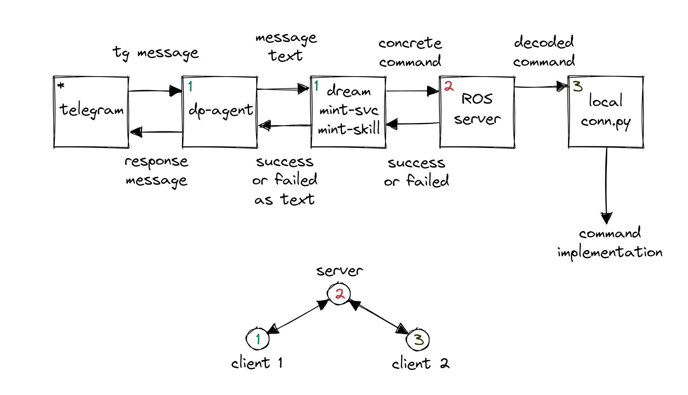

# dream_mint distribution



Basically the way this distro is supposed to function is as following:
1. recieve user input from the dp-agent of choice (e.g. Telegram);
2. process the recieved input in a way that results in a command (e.g. move forward 4 meters -> `move_forward_4`);
3. send the command to the ROS server (in order to make interacting with real robots possible);
4. process the message from inside ROS server and access local connector (e.g. real robot ROS-API, minecraft-interface);
5. (while not done in dream-side, it is useful to know that) the local connector then executes a command that usually corresponds with the message we recieved in step 2.

# Prerequisites:

1. Make sure that all services are correctly defined in dev.yml, proxy.yml, pipeline_conf.json.
2. Ensure that the ports for services and skills are unique and that the ports referenced by services and skills are correct.
3. Verify that in docker-compose.override.yml, the following is set: agent.channel=telegram agent.telegram_token=$TG_TOKEN.
4. Ensure that the Telegram bot token is set in the environment variables as $TG_TOKEN.

# Launch command:

```
docker-compose -f docker-compose.yml -f assistant_dists/dream_mint/docker-compose.override.yml -f \
assistant_dists/dream_mint/dev.yml -f assistant_dists/dream_mint/proxy.yml up --build --force-recreate; docker stop $(docker ps -aq)
```

Attention! The last part of the command stops all running containers on the machine. If this is not required, remove the part of the command after the semicolon or edit it to stop only specific containers if their names are known in advance.